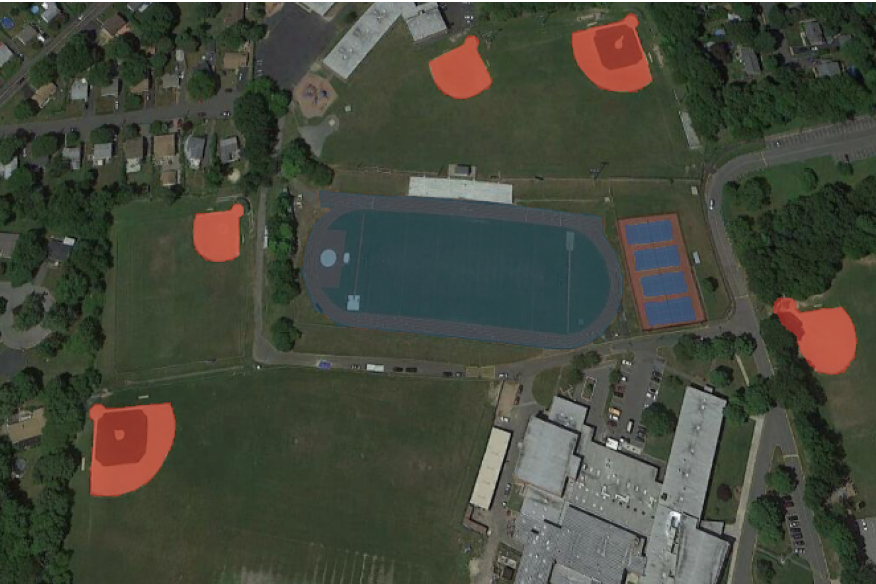

Semantic, Instance Segmentation and Object detection dataset for VHR remote sensing images further marked on the NWPU VHR-10 dataset in the standard coco dataset format.

# VHR-10_dataset_coco

NWPU VHR-10 data set is a challenging ten-class geospatial object detection data set. This dataset contains a total of 800 VHR optical remote sensing images, where 715 color images were acquired from Google Earth with the spatial resolution ranging from 0.5 to 2 m, and 85 pansharpened color infrared images were acquired from Vaihingen data with a spatial resolution of 0.08 m. The data set is divided into two sets: a) Positive image set which contains at least one target in an image contains 650 images. b) Negative image set contains 150 images and it does not contain any targets. From this the positive image set, 757 airplanes, 302 ships, 655 storage tanks, 390 baseball diamonds, 524 tennis courts, 159 basketball courts, 163 ground track fields, 224 harbors, 124 bridges, and 477 vehicles were manually annotated with bounding boxes and instance masks used for ground truth.

### Prepare data

This code takes NWPU VHR-10 dataset as example. You can download NWPU VHR-10 dataset and put them as follows. 

```
├── show_coco.py # visualization script
├── NWPU VHR-10_dataset_coco
    ├──positive image set # 650 images
       ├── ['.jpg']
       ├──    ...
       ├── ['.jpg']
	
    ├──annotations.json # 650 labels
    ├──split_datasets.py #randomly dividing dataset scripts.
```

### Training the Model
Train_Visualize.ipynb contains the complete pipeline code for traing the model and visualization of metrics.

[](https://colab.research.google.com/drive/1PSQORspqcJMWEqUPQPnEj1nYs3vw928p?usp=sharing)

### Dataset download link

NWPU VHR-10 dataset can be downloaded from [Google Cloud](https://drive.google.com/open?id=1--foZ3dV5OCsqXQXT84UeKtrAqc5CkAE)

### Installation pycocotools

```
pip install pycocotools
```

### Visualization results

<p align = "center">

</p>

<p align = "center">

</p>

<p align = "center">

</p>

<p align = "center">

</p>

<p align = "center">

</p>


<p align = "center">

</p>


<p align = "center">

</p>

### Acknowledgement

In addition, we are very grateful to NWPU for providing VHR remote sensing images. URL: [NWPU-VHR-10](http://www.escience.cn/people/gongcheng/NWPU-VHR-10.html).

### Citation

[1] L. Chen, G. Papandreou, I. Kokkinos, K. Murphy, A.L. Yuille, “Semantic Image Segmentation With Deep Convolutional Nets And Fully Connected CRFs,” DeepLabv1, 2014.

[2] L. Chen, G. Papandreou, I. Kokkinos, K. Murphy, A.L. Yuille, “DeepLab: Semantic Image Segmentation with Deep Convolutional Nets, Atrous Convolution, and Fully Connected CRFs,” DeepLabv2, 2016.

[3] L. Chen, G. Papandreou, F. Schroff, H. Adam, “Rethinking Atrous Convolution for Semantic Image Segmentation,” DeepLabv3, 2017.

[4] L. Chen, Z. Zhu, G. Papandreou, F. Schroff, H. Adam , “Encoder-Decoder with Atrous Separable Convolution for Semantic Image Segmentation,” DeepLabv3+, 2018.

### Dataset Citations 
If you feel this dataset is useful, please cite as the following format.

[1] Su H, Wei S, Yan M, et al. Object Detection and Instance Segmentation in Remote Sensing Imagery Based on Precise Mask R-CNN[C]. IGARSS 2019-2019 IEEE International Geoscience and Remote Sensing Symposium. IEEE, 2019: 1454-1457.

[2] Su, H.; Wei, S.; Liu, S.; Liang, J.; Wang, C.; Shi, J.; Zhang, X. HQ-ISNet: High-Quality Instance Segmentation for Remote Sensing Imagery. Remote Sens. 2020, 12, 989.

